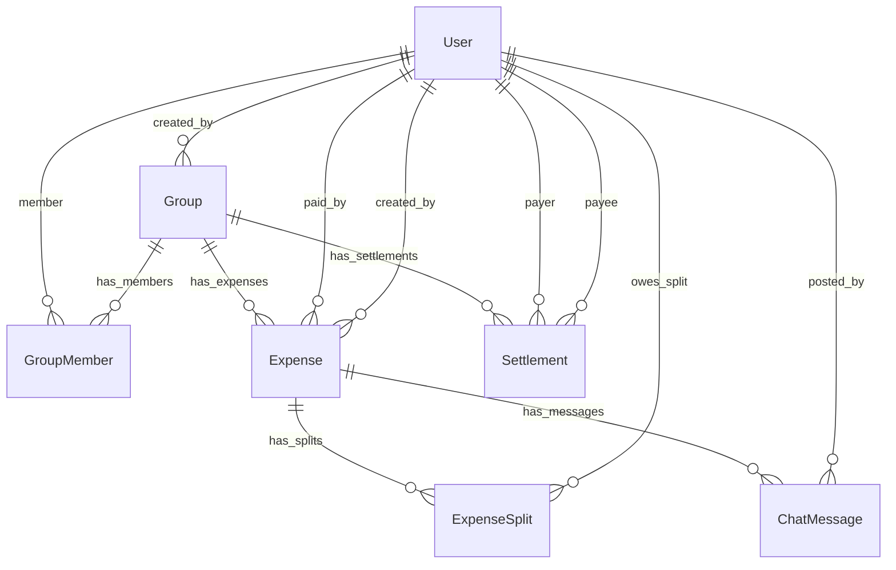

# Build Plan - Splitwise Clone

This document details the research, architecture, implementation process, and engineering tradeoffs for the Splitwise Clone project.

---

## 1. Product Research & Reverse Engineering

To study Splitwise and understand its core product behavior, we identified several vital workflows and models:

### Studied Workflows
1. **Expenses & Splits**: When a user registers an expense, they can assign other members to split it. We reverse-engineered four splitting methods:
   - **Equally**: Split split amount equally. If there are rounding discrepancies (e.g., $100 / 3 = $33.333...), the remaining cents are greedily assigned to the last user.
   - **Unequally**: Explicit amounts. The sum of splits must match the total cost.
   - **Percentage**: Proportions out of 100%. Percentages must sum to 100%.
   - **Share**: Ratio values (e.g., 2:1). Split is calculated proportionally: $\text{amount} \times (\text{user share} / \text{total shares})$.
2. **Dynamic Balances**: The balance of a user in a group is defined relative to the expenses paid by them, the expenses they are split into, and the settlements paid/received.
3. **Debt Simplification**: Instead of multiple cross-transfers (e.g., Alice owes Bob $10, Bob owes Charlie $10), we greedily match the overall debtors with the overall creditors inside a group. This minimizes the transaction count.
4. **Member Removal Constraints**: To keep debt tracking intact, a group member cannot leave or be removed if their current group balance is non-zero.
5. **Real-time Chat**: Inside each expense details screen, group members can chat or view system activity logs (e.g. who edited or created the expense).

---

## 2. Architecture & Tech Stack

### Technology Stack
- **Backend Framework**: Python + Django 4.2 + Django REST Framework (DRF)
- **Database**: SQLite (relational, portable, standard SQL support)
- **Frontend Framework**: React 18 (Vite-based Single-Page App)
- **Styling**: Vanilla CSS (Premium dark mode theme with glassmorphic cards and smooth transition animations)
- **Authentication**: JWT authentication (`djangorestframework-simplejwt`)
- **Icons**: Lucide Icons (`lucide-react`)

### Database Relational Schema

---

## 3. AI Collaboration Process

- **Initialization & Scope**: We started the project with a comprehensive interview layout (`implementation_plan.md`) to establish the exact boundaries of the application before writing code.
- **Source of Truth Maintenance**: We updated `AI_CONTEXT.md` in the workspace to contain the absolute design parameters, schemas, and endpoint names so that any subsequent development would align perfectly.
- **Backend Tests Integration**: We designed Django APITestCase tests to confirm splits mathematics (equal, unequal, percentage, share), balance calculations, and debt simplification. All tests passed successfully (`Ran 7 tests. OK`).
- **Frontend Integration**: We built React components (`Auth`, `Dashboard`, `GroupDetail`, `ExpenseModal`, `SettlementModal`, `ExpenseDetail`) using a modular architecture with native fetch APIs proxying requests to port 8000.

---

## 4. Tradeoffs & Simplifications

- **Real-Time Chat**: Instead of configuring WebSockets (which introduces complex Daphne/channels servers and external memory backends like Redis that are hard to deploy on free tiers), we used **short polling (3-second intervals)**. It is robust, works on all platforms out of the box, and fulfills the real-time requirements.
- **Database Engine**: We utilized **SQLite** for development and local testing since it requires no database configuration. It can be easily ported to PostgreSQL in production settings by updating Django's `DATABASES` settings.
- **Caching**: We calculate balances on the fly using database aggregation queries (`Sum`). For an MVP, this guarantees 100% data consistency without sync issues, although a high-traffic production application would cache balances or store running denormalized totals in a cache layer.
