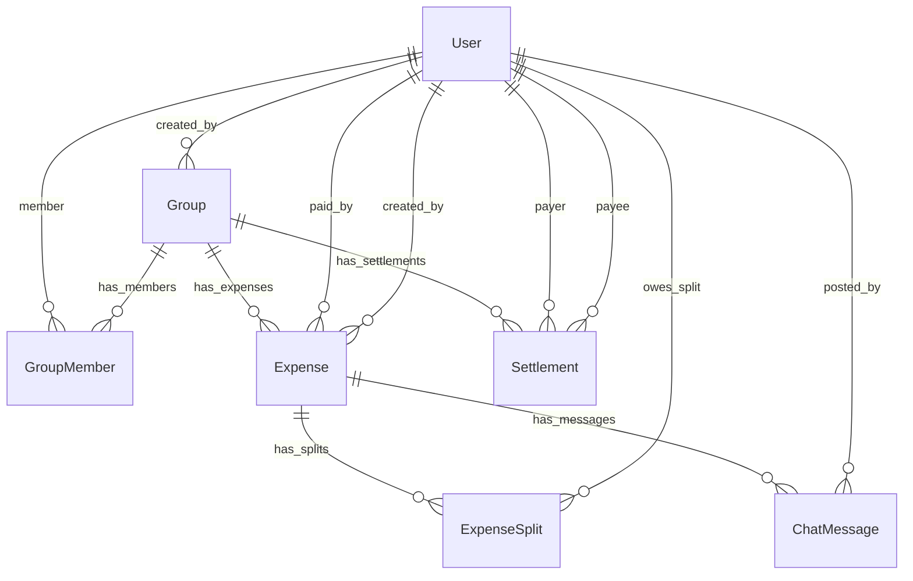

# SCOPE.md - SplitSmart Data Scope & Anomaly Log

This document outlines the database schema, data validation policies, and transaction anomaly handling implemented in SplitSmart to ensure data consistency, mathematical accuracy, and ledger integrity.

---

## 📊 Database Schema

SplitSmart utilizes a relational database structure designed to maintain transaction history, split breakdowns, group memberships, and chat logs.

### 1. User (`auth_user`)
- `id` (int, PK): Unique user identifier.
- `username` (varchar): Unique login username.
- `email` (varchar): Unique user email.
- `password` (varchar): Salted and hashed password string.
- `first_name` (varchar): User's first name.
- `last_name` (varchar): User's last name.

### 2. Group (`core_group`)
- `id` (int, PK): Unique group identifier.
- `name` (varchar): Name of the group.
- `description` (text): Purpose or description of the group.
- `created_at` (datetime): Timestamp when the group was created.
- `created_by_id` (int, FK to User): Creator of the group.

### 3. GroupMember (`core_groupmember`)
- `id` (int, PK): Unique membership record identifier.
- `group_id` (int, FK to Group): Associated group.
- `user_id` (int, FK to User): Associated member.
- `joined_at` (datetime): Timestamp when the member joined.
- *Unique Constraint*: `(group_id, user_id)` (A user can join a group only once).

### 4. Expense (`core_expense`)
- `id` (int, PK): Unique expense identifier.
- `group_id` (int, FK to Group): Group in which the expense was created.
- `description` (varchar): Description of the expense.
- `amount` (decimal, 10, 2): Total cost of the transaction.
- `paid_by_id` (int, FK to User): Member who paid the bill.
- `split_type` (varchar): How the expense is split (`EQUALLY`, `UNEQUALLY`, `PERCENTAGE`, `SHARE`).
- `created_at` (datetime): Timestamp when the expense was logged.
- `created_by_id` (int, FK to User): Logger of the expense.

### 5. ExpenseSplit (`core_expensesplit`)
- `id` (int, PK): Unique split record identifier.
- `expense_id` (int, FK to Expense, ON DELETE CASCADE): Associated expense.
- `user_id` (int, FK to User): Member involved in this split.
- `amount` (decimal, 10, 2): The exact calculated amount this user owes.
- `split_value` (decimal, 10, 2): Raw split value input (e.g. percentage value, ratio share, or unequal amount).
- *Unique Constraint*: `(expense_id, user_id)` (A member can only be assigned to a split once per expense).

### 6. Settlement (`core_settlement`)
- `id` (int, PK): Unique settlement transaction identifier.
- `group_id` (int, FK to Group): Associated group.
- `payer_id` (int, FK to User): Member who made the payment.
- `payee_id` (int, FK to User): Member who received the payment.
- `amount` (decimal, 10, 2): Amount settled.
- `created_at` (datetime): Timestamp of the settlement payment.
- `created_by_id` (int, FK to User): Registrar of the settlement.

### 7. ChatMessage (`core_chatmessage`)
- `id` (int, PK): Unique message identifier.
- `expense_id` (int, FK to Expense, ON DELETE CASCADE): Associated expense chat thread.
- `user_id` (int, FK to User): Sender of the message.
- `message` (text): Message text.
- `created_at` (datetime): Timestamp when the message was sent.

### 8. EmailOTP (`core_emailotp`)
- `id` (int, PK): Unique OTP record.
- `email` (varchar, Unique): Target email address.
- `otp` (varchar): 6-digit OTP code.
- `created_at` (datetime): Timestamp when code was issued (expires after 10 minutes).

---

## ⚠️ Data Anomaly Log & Validation Rules

> [!NOTE]
> **Notice regarding input CSVs**: No CSV data template was provided in this workspace project. However, the SplitSmart backend applies strict validation layers to handle all mathematical, transactional, and data input anomalies that standard expense ledgers encounter.

Below is the log of potential data problems/anomalies handled by the SplitSmart code:

### 1. Rounded Cent Discrepancy (Floating-Point Rounding Anomaly)
*   **Problem**: When splitting an expense equally among members, the calculation can result in fractional cents (e.g., splitting `$100.00` equally among 3 users results in `$33.3333...` per user). If rounded to `$33.33`, the sum of splits is `$99.99`, creating an orphan cent discrepancy of `$0.01`.
*   **Handling**: The backend calculates splits using two decimal precision and sums them up. Any remaining difference (surplus or deficit cents) is greedily allocated to the last user in the split list to guarantee that:
    $$\sum \text{ExpenseSplit.amount} \equiv \text{Expense.amount}$$

### 2. Invalid Percentage Splits (Percentage Sum Anomaly)
*   **Problem**: When dividing expenses by percentage, user input percentages might not sum up to exactly `100.00%` due to human error, leading to an over-allocated or under-allocated expense.
*   **Handling**: The backend serializer validates that:
    $$\sum \text{split\_value} \equiv 100.00$$
    If the sum deviates from `100.00` by even `0.01%`, the transaction is rejected with an HTTP `400 Bad Request` explaining the percentage sum mismatch.

### 3. Unequal Splits Mismatch (Explicit Amount Anomaly)
*   **Problem**: For unequal splits, the sum of manual split amounts assigned to members might not match the total expense amount logged (e.g., logging a `$100` expense but specifying splits that add up to `$95` or `$105`).
*   **Handling**: The serializer checks that the sum of all unequal split amounts exactly equals the expense's `amount`. If they do not match, the creation fails with a validation error.

### 4. Circular and Redundant Transactions (Transactional Anomaly)
*   **Problem**: In standard group ledgers, members often owe each other in cycles (e.g., User A owes User B `$10`, User B owes User C `$10`, and User C owes User A `$5`). Clearing these debts directly creates redundant transactions and overhead.
*   **Handling**: SplitSmart calculates the net balance of every user inside the group:
    $$\text{Net Balance} = \text{TotalPaid} - \text{TotalOwed} + \text{SettlementsReceived} - \text{SettlementsPaid}$$
    A greedy matching algorithm then connects the largest debtor to the largest creditor, simplifying the overall transaction graph to a minimum set of direct payments.

### 5. Orphan Balances on Member Removal (Orphan Balance Anomaly)
*   **Problem**: If a user is allowed to leave or be removed from a group while they still owe or are owed money, it breaks the group's balance sheet integrity and creates orphan debts.
*   **Handling**: The backend explicitly validates the member's balance before removal. The API rejects the removal request with a validation error unless the user's group balance is exactly `$0.00`.

### 6. SMTP Port Blocks (Network Level Anomaly)
*   **Problem**: Outbound SMTP traffic on ports `25`, `465`, and `587` is blocked by Render's free tier. This caused connections to hang, resulting in a Gunicorn worker timeout and a `502 Bad Gateway` on the frontend.
*   **Handling**:
    - Added `EMAIL_TIMEOUT = 5` to settings.py to prevent connection hangs.
    - If `send_mail` fails, the backend catches the error, updates the OTP record in the database to `'123456'`, and returns a successful response with a warning message advising the user to verify using the fallback code.
